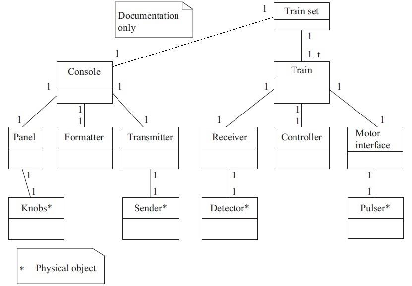
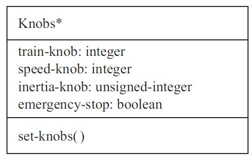
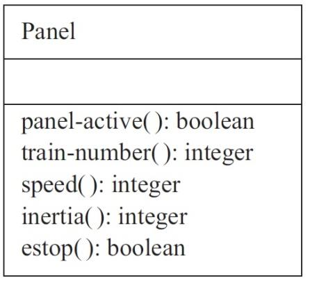
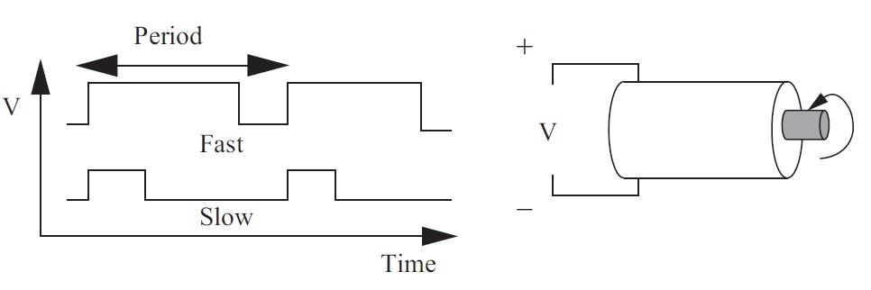
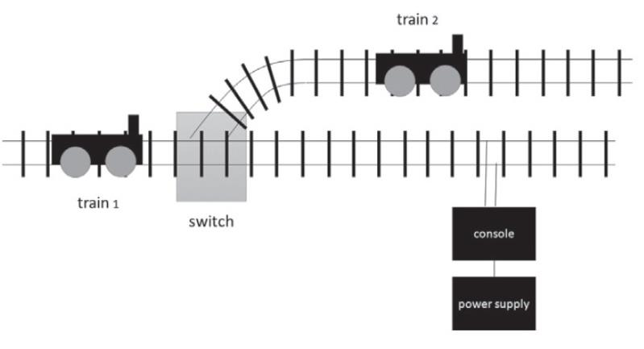

> Departamento de Engenharia e Computação (DEC)
>
> **Disciplina:** **BiSuEEA.512** **–** **Sistemas** **Embarcados**
>
> 2o trimestre – 2025
>
> Data: 09/10/2025

Instrutor: Williams L. Nicomedes

Laboratório de Automação e Controle – Núcleo 2 de Laboratórios, Sala 02

[<u>williams.nicomedes@ifmg.edu.br</u>](mailto:williams.nicomedes@ifmg.edu.br)

> Lista de Exercícios n°1 – (10 pontos)

**Exemplo** **de** **projeto:** **Ferromodelismo**

O diagrama mostrado na Fig. 1 (página 18, Notas de Aula 05) é resultado
da especificação conceitual (*conceptual* *specification*), e define as
classes básicas empregadas na modelagem do sistema. Note que os
atributos e operações de cada classe não foram definidos.

Na especificação detalhada (*detailed* *specification*), a descrição de
cada classe passa por um processo de refinamento.

Por exemplo, a classe *Knobs* modela os botões (giratórios) presentes no
painel, e pode ser refinada de acordo com a Fig. 2.

Os atributos desta classe são:

*train-knob*: Número do tipo inteiro que indica o trem que está sendo
controlado. Como o sistema comporta até 8 trens, este número pode ser
codificado em 3 bits (000, 001, ..., 111).

*speed-knob*: Número do tipo inteiro (entre 0 e 63) que indica a
velocidade do trem. Como o sistema prevê 63 níveis de velocidade (mais a
velocidade 0), este número pode ser codificado em 6 bits (000 000, 000
001, ..., 111 111). Há ainda um outro bit, que indica movimento para
frente (“1”), e para trás (“0”). No total, são empregados 7 bits.

*inertia-knob*: Número do tipo inteiro não-negativo que indica a inércia
do trem (resistência à mudança de velocidade). Não especificamos aqui
quais os valores possíveis para este campo, porém podemos proceder como
no caso dos dois atributos descritos acima.

> **Fig.** **1**. Diagrama de classes resultante da especificação
> conceitual do sistema.
>
> **Fig.** **2**. Refinamento da classe *Knobs*.

Por exemplo, poderíamos especificar 4 níveis de inércia, refletindo um
trem vazio (nível 1) até um trem totalmente carregado (nível 4). Este
número seria então codificado em 2 bits (00, 01, 10, 11).

*emergency_stop*: Variável do tipo booleana que indica se o botão de
parada de emergência foi pressionado ou não. Um único bit é necessário
para codificar esta variável (botão pressionado = 1, e botão
não-pressionado = 0).

Há ainda uma operação *set-knobs*(), que em princípio não retorna
nenhuma variável. Esta operação pode ser descrita da seguinte forma:

Ao inicializar o sistema,

\- O usuário seleciona o trem 1, escolha sua velocidade

\- O usuário seleciona o trem 2, escolha sua velocidade

e sua inércia ;

> e sua inércia ;

(...)

\- O usuário seleciona o trem 8, escolha sua velocidade e sua inércia .

Todos os trens agora estão rodando com suas respectivas velocidades e
inércias. O último trem a ser configurado foi o trem 8, de modo que a
classe *Knobs* foi instanciada em:

*train-knob* *=* *8*;

*speed-knob* = ;

*inertia-knob* = ;

*emergency_stop* *=* *0.*

Suponhamos agora que o usuário queira alterar a velocidade do trem 5.
Ele então:

\- Seleciona o trem 5, i.e., insere o valor 5 no campo *train-knob*.

Entretanto, ele ainda **não** **inseriu** **os** **valores** **de**
**velocidade** **e** **de** **inércia**. Neste momento, a classe *Knobs*
foi instanciada em:

*train-knob* = 5;

*speed-knob* = ;

*inertia-knob* = ;

*emergency_stop* *=* *0.*

Porém, **o** **usuário** **não** **quer** **atribuir** **a**
**velocidade** **e** **a** **inércia** **do** **trem** **8** **para**
**o** **trem** **5!** (Se for muito diferente de , o trem 5 poderia
sofrer um “tranco”.) É aí que entra a operação *set-knobs*(): Quando o
usuário:

\- Seleciona o trem 5, i.e., insere o valor 5 no campo *train-knob*,

a classe *Knobs* não deve ser instanciada como mostrado acima, mas como:

*train-knob* = 5;

*speed-knob* = ;

*inertia-knob* = ;

*emergency_stop* *=* *0.*

Ou seja, quando o usuário muda o campo *train-knob* de 8 para 5, um
evento é gerado, que chama a operação *set-knobs*(). Esta operação
<u>volta com os antigos valores de velocidade e de inércia</u> <u>para o
trem 5,</u> i.e., ela automaticamente faz *speed-knob* = e
*inertia-knob* = . Agora o usuário pode modificá-las de forma suave.

(***Obs***.: A nível de programação, possivelmente os valores de
velocidade e inércia para cada trem são armazenados em variáveis
internas.)

A classe *Panel* é responsável por ler o estado atual dos botões
(atributos da classe *Knobs*). Ela pode ser detalhada como na Fig. 3.

Esta classe não possui nenhum atributo. Entretanto, ela possui operações
(que não recebem nenhum parâmetro, e que provavelmente são disparadas
por eventos):

> **Fig.** **3**. Refinamento da classe *Panel*.

*panel-active*(): Retorna uma variável do tipo booleana que codifica se
o painel do console está ativo ou inativo (por exemplo, o console possui
uma chave que permite ativá-lo ou travá-lo, i.e., o usuário não pode
mudar os valores de velocidade e inércia dos trens);

*train-number*(): Retorna/armazena/captura a variável do tipo inteiro
que o usuário inseriu no atributo *train-knob* da classe *Knobs*;

*speed*(): Retorna/armazena/captura a variável do tipo inteiro que o
usuário inseriu no atributo *speed-knob* da classe *Knobs*;

*inertia*(): Retorna/armazena/captura a variável do tipo inteiro que o
usuário inseriu no atributo *inertia-knob* da classe *Knobs*;

*estop*(): Retorna uma variável do tipo booleana que codifica se o botão
de parada de emergência (*emergency_stop*) da classe *Knobs* foi
pressionado pelo usuário.

A partir daí, o console reúne e envia os valores numéricos para o
„formatador‟ (*Formatter*), que os converterá para bits, que por sua vez
servirão de base para a modulação do sinal de alimentação, realizada
pelo transmissor (*Transmitter*), ver Fig. 1.

**Atividades**

***Questão*** ***1*** – O motor de cada trem é controlado através de
modulação por largura de pulso (PWM). Baixas velocidades empregam uma
largura de pulso menor, enquanto velocidades mais altas empregam uma
largura de pulso maior, ver Fig. 4.

A classe *Motor-interface* (Fig. 1) é a responsável por produzir a forma
de onda PWM, a partir do valor de velocidade enviado pelo controlador do
trem (*Controller*). Esta forma de onda será enviada ao motor pelo
„pulsador‟ (*Pulser*), que é apenas um circuito eletrônico (i.e., não
exige maiores detalhes neste nível).

Como a classe *Motor-interface* (mostrada sem nenhum atributo ou
operação) na Fig. 1 poderia ser refinada?

***Questão*** ***2*** – No nosso sistema de ferromodelismo, o usuário
pode enviar sinais de controle apenas para os trens. A pista (trilhos)
não é sujeita a alterações. Entretanto, um modelo mais sofisticado pode
incorporar modifcações nas ligações entre um trilho e outro, o que
permite a um trem mudar de trilho/direção. Isto pode ser realizado
através de *switches* (ver Fig. 5).

> **Fig.** **4**. Princípio da PWM.

Suponha que nossa pista possui um conjunto de até no máximo 16
*switches*, e que cada *switch* permite a ramificação em 2 trilhos.

Descreva uma possível maneira de incorporar esta modificação ao sistema.

>  style="width:3.63305in;height:1.96806in" /> style="width:0.45167in;height:0.23333in" />**Fig.**
> **5**. Os switches são empregados para mudar a direção dos trens.
>
> *(a)*
>
>  style="width:2.95861in;height:1.96805in" /> style="width:0.45333in;height:0.23333in" />*(b)*
>
>  style="width:2.96056in;height:2.44028in" /> style="width:0.45333in;height:0.23333in" />*(c)*

Objetivos do trabalho: Perceber que:

1\. Especificar um sistema não é fácil;

2\. Podemos aprender muito sobre o funcionamento do sistema que estamos
tentando construir quando escrevemos a sua especificação.

**Entrega**: Até às 23:59 do dia 30/10/2025, <u>pelo AVA</u>.
<u>Converter em .pdf.</u>
