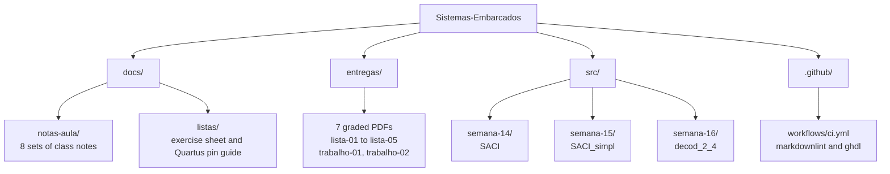

**Read this in other languages:** [English](README.md) | [Português (BR)](README.pt-BR.md)

# Sistemas Embarcados

Coursework for the Embedded Systems course at IFMG Campus Bambuí. Combinational
and sequential logic in VHDL, built and simulated in Quartus II.

[](https://github.com/RxSaturn/Sistemas-Embarcados/actions/workflows/ci.yml)
[](LICENSE)
[](https://github.com/RxSaturn/Sistemas-Embarcados/commits/main)
[](src/)
[](https://www.intel.com/content/www/us/en/products/details/fpga/development-tools/quartus-prime.html)

## Table of contents

- [About](#about)
- [Repository structure](#repository-structure)
- [What is in here](#what-is-in-here)
- [Run the VHDL](#run-the-vhdl)
- [Open the Quartus II files](#open-the-quartus-ii-files)
- [Tech stack](#tech-stack)
- [Scope](#scope)
- [License](#license)

## About

This repository holds the work for **BiSuEEA.512 – Sistemas Embarcados**, taught in
the second semester of 2025 at the Instituto Federal de Minas Gerais, Campus Bambuí.
The course covers digital system design, from a truth table to a circuit running on
an FPGA. The material moves from combinational logic to VHDL processes, and then to
JK flip-flops and counters.

The code models real control problems, not textbook gates. The Semana 14 design is
an automatic irrigation controller. Two soil humidity sensors and a manual switch
drive a solenoid valve and two indicator LEDs. Semana 15 rebuilds the same circuit
with a selected signal assignment, which shows that a truth table and a boolean
simplification describe one circuit.

## Repository structure



## What is in here

### VHDL designs

Each folder holds one VHDL file, one Quartus II schematic, and one Quartus II
waveform.

| Folder | Entity | What it does |
| --- | --- | --- |
| `src/semana-14/` | `SACI` | Automatic irrigation controller. Inputs `U1`, `U2`, `C`. Outputs `E`, `LA`, `LV`. Built from product terms. |
| `src/semana-15/` | `SACI_simpl` | The same controller, rebuilt with `with ... select`. The truth table drives the outputs directly. |
| `src/semana-16/` | `decod_2_4` | A 2-to-4 decoder with an enable input, written with a `case` inside a process. |

<!-- TODO(img): docs/img/quartus-esquematico-saci.png — Quartus II Block Editor showing src/semana-14/esquematico.bdf, with the input pins U1, U2, C on the left and E, LA, LV on the right -->

<!-- TODO(img): docs/img/quartus-waveform-saci.png — Quartus II Waveform Editor after a functional simulation of SACI, showing all 8 input combinations and the resulting E, LA, LV -->

### Class notes

| File | Date | Topic |
| --- | --- | --- |
| [`notas-aula-09`](docs/notas-aula/notas-aula-09.md) | 30/10/2025 | Sistemas digitais |
| [`notas-aula-10`](docs/notas-aula/notas-aula-10.md) | 06/11/2025 | Introdução |
| [`notas-aula-12`](docs/notas-aula/notas-aula-12.md) | 18/11/2025 | Fluxo de projeto |
| [`notas-aula-14`](docs/notas-aula/notas-aula-14.md) | 04/12/2025 | Classes de objetos em VHDL |
| [`notas-aula-15`](docs/notas-aula/notas-aula-15.md) | 11/12/2025 | Tipos de dados em VHDL |
| [`notas-aula-16`](docs/notas-aula/notas-aula-16.md) | 18/12/2025 | Processos |
| [`notas-aula-20`](docs/notas-aula/notas-aula-20.md) | 15/01/2026 | FF tipo JK: elemento de memória |
| [`notas-aula-21`](docs/notas-aula/notas-aula-21.md) | 22/01/2026 | FF tipo JK: contadores |

> [!NOTE]
> The set is not complete. Notes 11, 13, 17, 18 and 19 are not in this repository.

### Other documents

| File | What it is |
| --- | --- |
| [`lista-03-enunciado.md`](docs/listas/lista-03-enunciado.md) | The exercise sheet for Lista 3, as handed out |
| [`guia-lista-05.md`](docs/listas/guia-lista-05.md) | How to wire a VHDL block to input and output pins in Quartus II |
| `entregas/` | The 7 graded submissions as PDF |

## Run the VHDL

GHDL compiles and simulates the VHDL without Quartus II. It runs on Linux, macOS
and Windows.

```bash
sudo apt-get install -y ghdl
```

Analyze a design and then elaborate it:

```bash
mkdir -p build/ghdl
ghdl -a --std=08 --workdir=build/ghdl src/semana-14/saci.vhd
ghdl -e --std=08 --workdir=build/ghdl SACI
```

Check all three designs at once:

```bash
mkdir -p build/ghdl
for file in src/semana-*/*.vhd; do
  ghdl -a --std=08 --workdir=build/ghdl "$file"
done
for unit in SACI SACI_simpl decod_2_4; do
  ghdl -e --std=08 --workdir=build/ghdl "$unit"
done
```

The CI workflow runs these same commands on every push and pull request.

> [!NOTE]
> The designs carry no testbench, so `ghdl -r` has nothing to run. GHDL checks that
> the code compiles and elaborates. To see the outputs, simulate in Quartus II with
> the `.vwf` file in each folder.

## Open the Quartus II files

The `.bdf` and `.vwf` files come from Quartus II 13.0. Open them in Quartus II or
Quartus Prime.

1. Create a new project and add the `.vhd` file from the folder.
2. Open the `.bdf` file. It holds the schematic with the pins already placed.
3. Set the `.bdf` file as the Top-Level Entity.
4. Compile the project.
5. Open the `.vwf` file and run a functional simulation.

[`guia-lista-05.md`](docs/listas/guia-lista-05.md) explains step 2 in detail,
including the pin naming rule that stops a name clash with the VHDL entity.

## Tech stack

| Tool | Version | Used for |
| --- | --- | --- |
| VHDL | 93 and 2008 | Hardware description |
| Quartus II | 13.0 | Schematic capture, compilation, waveform simulation |
| GHDL | 4.1 | Compile and elaborate outside Quartus II |
| GitHub Actions | — | Lint the Markdown, analyze the VHDL |

## Scope

This is coursework, kept public as a record of the course. Read it that way.

- The designs target a classroom FPGA board. They are not production hardware.
- The three VHDL files carry no testbench. CI proves that they compile and
  elaborate. CI does not prove that they are functionally correct.
- `docs/notas-aula/` holds lecture material by the course instructor,
  Williams L. Nicomedes, converted from the original slides. The conversion kept
  every figure as a text description, because the repository does not store the
  images.

## License

The code and the documents written by the repository author are released under the
[MIT License](LICENSE).

The lecture notes under `docs/notas-aula/` remain the work of the course
instructor. MIT does not transfer any right over that material.
