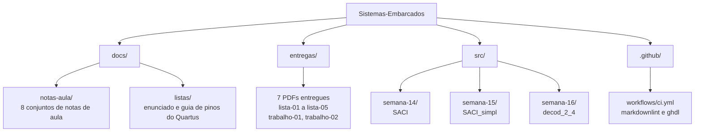
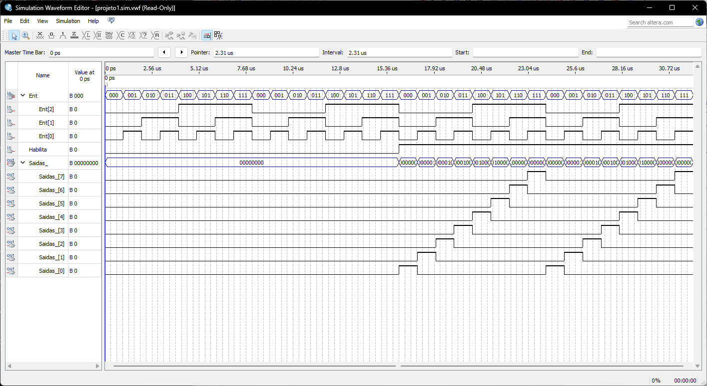
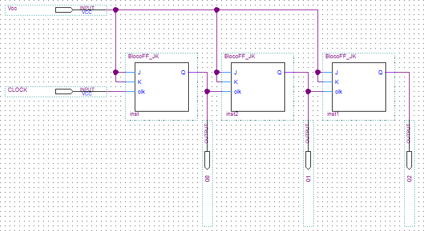

**Leia em outros idiomas:** [English](README.md) | [Português (BR)](README.pt-BR.md)

# Sistemas Embarcados

Trabalhos da disciplina de Sistemas Embarcados do IFMG Campus Bambuí. Lógica
combinacional e sequencial em VHDL, montada e simulada no Quartus II.

[](https://github.com/RxSaturn/Sistemas-Embarcados/actions/workflows/ci.yml)
[](LICENSE)
[](https://github.com/RxSaturn/Sistemas-Embarcados/commits/main)
[](src/)
[](https://www.intel.com/content/www/us/en/products/details/fpga/development-tools/quartus-prime.html)

## Sumário

- [Sobre](#sobre)
- [Estrutura do repositório](#estrutura-do-repositório)
- [O que tem aqui](#o-que-tem-aqui)
- [Resultados](#resultados)
- [Executar o VHDL](#executar-o-vhdl)
- [Abrir os arquivos do Quartus II](#abrir-os-arquivos-do-quartus-ii)
- [Ferramentas](#ferramentas)
- [Escopo](#escopo)
- [Licença](#licença)

## Sobre

Este repositório reúne o trabalho de **BiSuEEA.512 – Sistemas Embarcados**,
cursada no segundo semestre de 2025 no Instituto Federal de Minas Gerais, Campus
Bambuí. A disciplina trata do projeto de sistemas digitais, da tabela-verdade ao
circuito rodando em FPGA. O material vai da lógica combinacional aos processos em
VHDL, e depois aos flip-flops JK e contadores.

Os códigos modelam problemas reais de controle, e não portas lógicas soltas. O
projeto da Semana 14 é um controlador automático de irrigação. Dois sensores de
umidade do solo e uma chave manual comandam uma eletroválvula e dois LEDs. A
Semana 15 refaz o mesmo circuito com atribuição seletiva, o que mostra que a
tabela-verdade e a simplificação booleana descrevem um único circuito.

## Estrutura do repositório



## O que tem aqui

### Projetos em VHDL

Cada pasta tem um arquivo VHDL, um esquemático do Quartus II e uma forma de onda
do Quartus II.

| Pasta | Entity | O que faz |
| --- | --- | --- |
| `src/semana-14/` | `SACI` | Sistema Automático de Controle de Irrigação. Entradas `U1`, `U2`, `C`. Saídas `E`, `LA`, `LV`. Montado por termos-produto. |
| `src/semana-15/` | `SACI_simpl` | O mesmo controlador, refeito com `with ... select`. A tabela-verdade comanda as saídas diretamente. |
| `src/semana-16/` | `decod_2_4` | Decodificador de 2 para 4 com entrada de habilitação, escrito com `case` dentro de um process. |

### Notas de aula

| Arquivo | Data | Tema |
| --- | --- | --- |
| [`notas-aula-09`](docs/notas-aula/notas-aula-09.md) | 30/10/2025 | Sistemas digitais |
| [`notas-aula-10`](docs/notas-aula/notas-aula-10.md) | 06/11/2025 | Introdução |
| [`notas-aula-12`](docs/notas-aula/notas-aula-12.md) | 18/11/2025 | Fluxo de projeto |
| [`notas-aula-14`](docs/notas-aula/notas-aula-14.md) | 04/12/2025 | Classes de objetos em VHDL |
| [`notas-aula-15`](docs/notas-aula/notas-aula-15.md) | 11/12/2025 | Tipos de dados em VHDL |
| [`notas-aula-16`](docs/notas-aula/notas-aula-16.md) | 18/12/2025 | Processos |
| [`notas-aula-20`](docs/notas-aula/notas-aula-20.md) | 15/01/2026 | FF tipo JK: elemento de memória |
| [`notas-aula-21`](docs/notas-aula/notas-aula-21.md) | 22/01/2026 | FF tipo JK: contadores |

> [!NOTE]
> O conjunto não está completo. As notas 11, 13, 17, 18 e 19 não estão neste
> repositório.

### Outros documentos

| Arquivo | O que é |
| --- | --- |
| [`lista-03-enunciado.md`](docs/listas/lista-03-enunciado.md) | O enunciado da Lista 3, como foi entregue |
| [`guia-lista-05.md`](docs/listas/guia-lista-05.md) | Como ligar um bloco VHDL a pinos de entrada e saída no Quartus II |
| [`resultados.md`](docs/resultados.md) | Capturas do Quartus II de cada circuito entregue |
| `entregas/` | As 7 entregas corrigidas, em PDF |

## Resultados

Todos os circuitos abaixo foram montados e simulados no Quartus II. As capturas vêm
das entregas corrigidas. O arquivo [`docs/resultados.md`](docs/resultados.md) traz o
conjunto completo, com esquemático e forma de onda de cada exercício.

Um decodificador 3 para 8 com entrada de habilitação, da Lista 5:

![Esquemático do decod_3_8 no Quartus II. Os pinos Ent[2..0] e Habilita entram à esquerda, o barramento Saidas_[7..0] sai à direita](docs/img/decod-3-8-esquematico.png)

A simulação separa dois regimes. Antes de 16 µs a habilitação está em `0` e todas as
saídas ficam em `0`. Depois de 16 µs cada combinação de entrada aciona exatamente uma
saída:



Um contador MOD 8 construído com três flip-flops JK, do Trabalho 1:



## Executar o VHDL

O GHDL compila e simula o VHDL sem o Quartus II. Ele roda em Linux, macOS e
Windows.

```bash
sudo apt-get install -y ghdl
```

Analise um projeto e depois elabore:

```bash
mkdir -p build/ghdl
ghdl -a --std=08 --workdir=build/ghdl src/semana-14/saci.vhd
ghdl -e --std=08 --workdir=build/ghdl SACI
```

Para conferir os três projetos de uma vez:

```bash
mkdir -p build/ghdl
for file in src/semana-*/*.vhd; do
  ghdl -a --std=08 --workdir=build/ghdl "$file"
done
for unit in SACI SACI_simpl decod_2_4; do
  ghdl -e --std=08 --workdir=build/ghdl "$unit"
done
```

O workflow de CI roda estes mesmos comandos a cada push e pull request.

> [!NOTE]
> Os projetos não têm testbench, então `ghdl -r` não tem o que executar. O GHDL
> confere que o código compila e elabora. Para ver as saídas, simule no Quartus II
> com o arquivo `.vwf` de cada pasta.

## Abrir os arquivos do Quartus II

Os arquivos `.bdf` e `.vwf` vêm do Quartus II 13.0. Abra no Quartus II ou no
Quartus Prime.

1. Crie um projeto novo e adicione o arquivo `.vhd` da pasta.
2. Abra o arquivo `.bdf`. Ele traz o esquemático com os pinos já colocados.
3. Defina o arquivo `.bdf` como Top-Level Entity.
4. Compile o projeto.
5. Abra o arquivo `.vwf` e rode uma simulação funcional.

O [`guia-lista-05.md`](docs/listas/guia-lista-05.md) detalha o passo 2, incluindo
a regra de nomes que evita conflito com a entity VHDL.

## Ferramentas

| Ferramenta | Versão | Para que serve |
| --- | --- | --- |
| VHDL | 93 e 2008 | Descrição de hardware |
| Quartus II | 13.0 | Esquemático, compilação, simulação de formas de onda |
| GHDL | 4.1 | Compilar e elaborar fora do Quartus II |
| GitHub Actions | — | Checar o Markdown e analisar o VHDL |

## Escopo

Este é um repositório de disciplina, mantido público como registro do curso. Leia
com essa expectativa.

- Os projetos são para uma placa FPGA de laboratório. Não são hardware de produção.
- Os três arquivos VHDL não têm testbench. O CI prova que eles compilam e elaboram.
  O CI não prova que estão funcionalmente corretos.
- A pasta `docs/notas-aula/` traz material de aula do professor da disciplina,
  Williams L. Nicomedes, convertido dos slides originais. A conversão manteve cada
  figura como descrição em texto, porque o repositório não guarda as imagens.

## Licença

O código e os documentos escritos pelo autor do repositório estão sob a
[Licença MIT](LICENSE).

As notas de aula em `docs/notas-aula/` continuam sendo obra do professor da
disciplina. A licença MIT não transfere nenhum direito sobre esse material.
