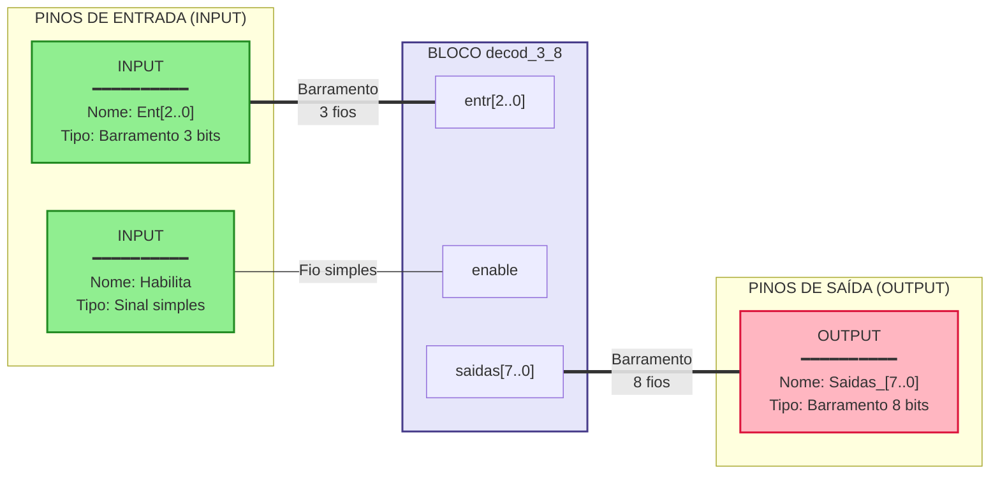
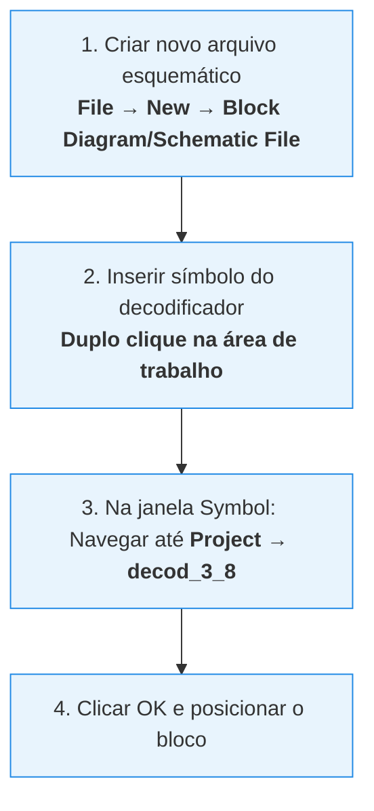
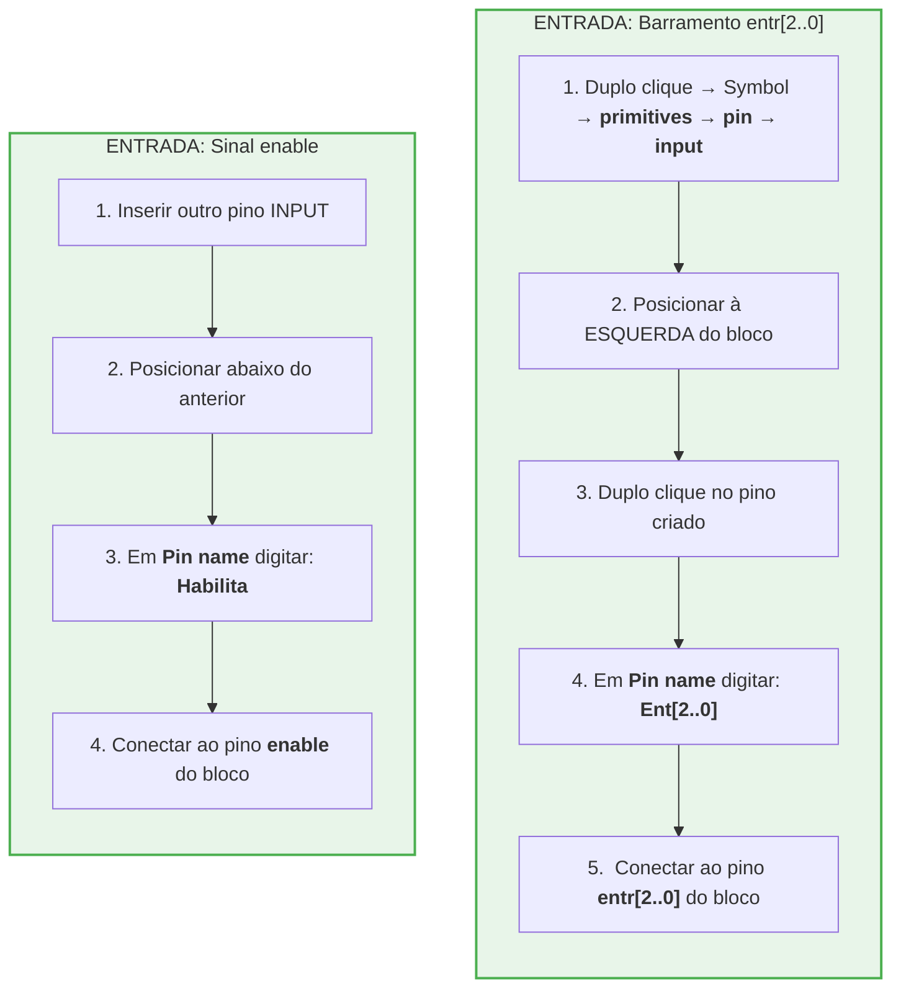
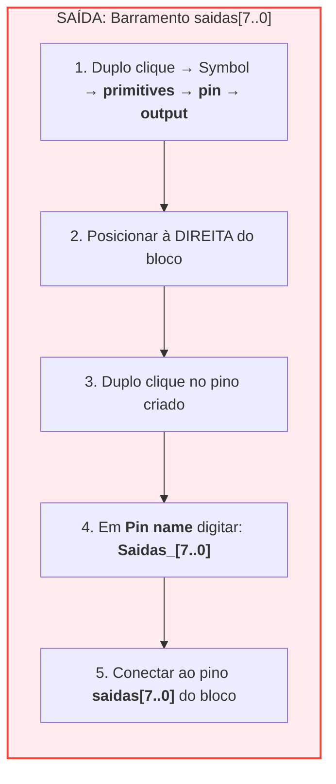
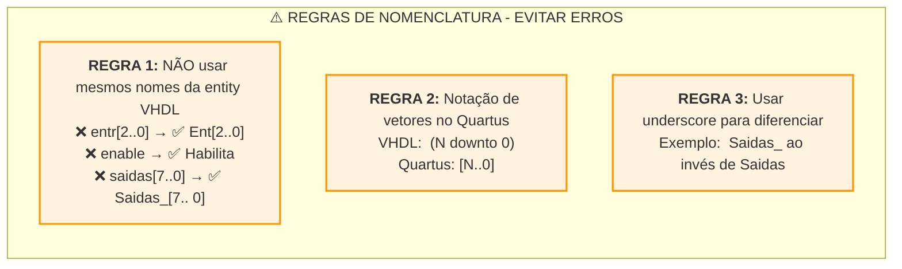
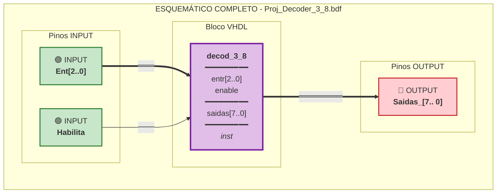
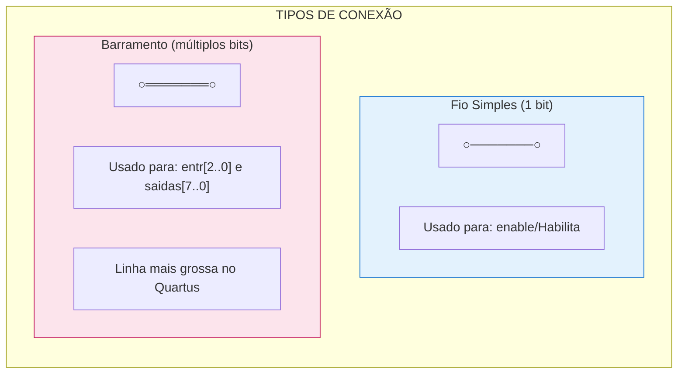
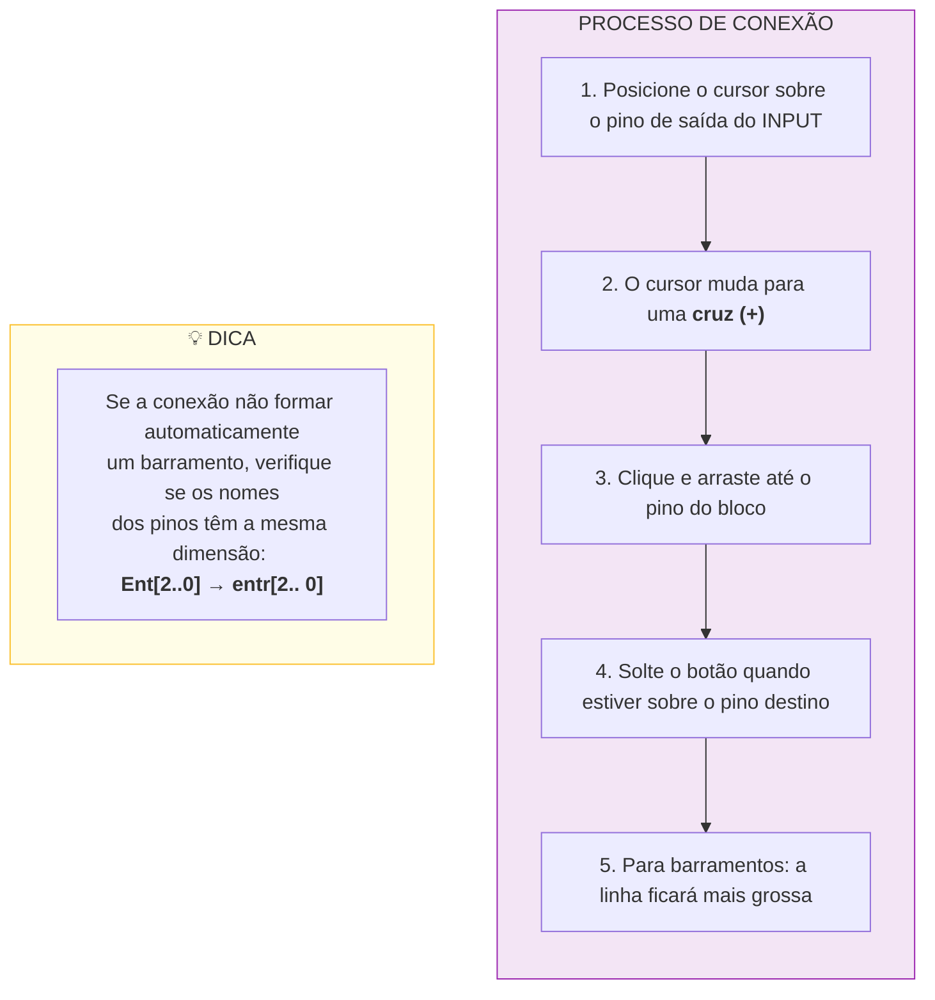
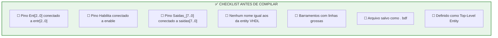

# Guia de Conexão dos Pinos no Quartus II

Com base na imagem do bloco `decod_3_8` gerado, vou explicar detalhadamente como realizar as conexões de entrada e saída no esquemático. 

## Análise do Bloco Gerado

Observando a imagem , o bloco possui: 
- **Entradas**: `entr[2..0]` (barramento de 3 bits) e `enable` (sinal simples)
- **Saídas**: `saidas[7..0]` (barramento de 8 bits)

## Diagrama de Conexão Completo



## Processo Passo a Passo

### Passo 1: Inserir o Bloco no Esquemático



### Passo 2: Adicionar Pinos de Entrada



### Passo 3: Adicionar Pino de Saída



## Regras Importantes para Nomenclatura



## Diagrama do Esquemático Final



## Tipos de Conexão (Fios)



## Como Fazer as Conexões



## Checklist Final



## Resumo Visual do Esquemático Esperado

```
    ┌─────────────────────────────────────────────────────────┐
    │                   Proj_Decoder_3_8.bdf                  │
    │                                                         │
    │   ┌──────────┐      ┌─────────────┐      ┌──────────┐  │
    │   │  INPUT   │      │  decod_3_8  │      │  OUTPUT  │  │
    │   │          │      │             │      │          │  │
    │   │Ent[2..0] │══════│entr[2..0]   │      │          │  │
    │   └──────────┘      │             │      │          │  │
    │                     │      saidas[7..0]│══│Saidas_[7..0]│
    │   ┌──────────┐      │             │      │          │  │
    │   │  INPUT   │      │             │      └──────────┘  │
    │   │          │      │             │                    │
    │   │ Habilita │──────│enable       │                    │
    │   └──────────┘      │             │                    │
    │                     │    inst     │                    │
    │                     └─────────────┘                    │
    │                                                         │
    └─────────────────────────────────────────────────────────┘
    
    Legenda:  ══════ Barramento (múltiplos bits)
              ────── Fio simples (1 bit)
```
