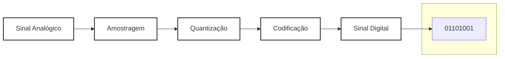

## Page 1

<!-- Imagem: Logo of Instituto Federal de Educação, Ciência e Tecnologia Minas Gerais Campus Bambuí -->

**INSTITUTO FEDERAL**
**DE EDUCAÇÃO, CIÊNCIA E TECNOLOGIA**
Minas Gerais
Campus Bambuí

**Disciplina:** BiSuEEA.512 – Sistemas Embarcados

2º semestre – 2025

Notas de Aula 09

**Instrutor:** Williams L. Nicomedes

Laboratório de Automação e Controle – Núcleo 2 de Laboratórios, Sala 02

williams.nicomedes@ifmg.edu.br

30/10/2025

---

## Page 2

# Sistemas digitais

**Aquisição:** Parte integrante de um sistema responsável por captar, medir e adequar um sinal presente na natureza. Interface com a mundo natural.

1.  **Transdução:** Processo que transforma uma grandeza física em um sinal elétrico **proporcional** à sua magnitude. Elemento principal: **Sensores**.

*Ex.:* Sensores resistivos (*R varia com a grandeza a ser medida*), capacitivos, indutivos, piezoeletricos, etc.

Termistor, LDR (*light dependent resistor*, ou fotorresistor), sensor de água, etc.

---

## Page 3

# Sistemas digitais: Aquisição

**Aquisição:** Parte integrante de um sistema responsável por captar, medir e adequar um sinal presente na natureza. Interface com a mundo natural.

1.  **Transdução**;
2.  **Condicionamento**: Recebe o sinal proveniente da etapa de transdução e realiza o tratamento necessário:
    *   **Filtragem** de ruídos;
    *   **Ajuste** dos níveis de tensão (amplificação, atenuação, etc.).

---

## Page 4

# Sistemas digitais: Aquisição

**Aquisição:** Parte integrante de um sistema responsável por captar, medir e adequar um sinal presente na natureza. Interface com a mundo natural.

1.  **Transdução**;
2.  **Condicionamento**;
3.  **Digitalização**: Responsável por transformar o sinal analógico (após o condicionamento) em digital.

**Conversor analógico-digital (A/D)**

---

## Page 5

# Sistema digital genérico – Diagrama de blocos

<!--
Imagem:
A diagram showing a generic digital system with three main stages: Acquisition, Conditioning, and Processing.

**Sistema de aquisição (Acquisition System):**
*   **Transdução (Conversion):** Converts a physical quantity (Grandeza Física) into an analog signal.
    *   **Sensor:** Converts the physical quantity into an analog signal.
    *   **Filtro (Filter):** Processes the analog signal.
    *   **Amplificador (Amplifier):** Increases the amplitude of the analog signal.
    *   **Sinal Analógico (Analog Signal):** Output of the amplifier, with a range of 0 to 100 mV.

**Condicionamento (Conditioning):**
*   **Digitalização (Digitization):** Converts the analog signal into a digital signal.
    *   **Sinal Digital (Digital Signal):** Output of the digitization process, with a range of 0 to 1,2 V.

**Processamento (Processing):**
*   **Microcontrolador, FPGA ou ASIC (Microcontroller, FPGA or ASIC):** Processes the digital signal.
    *   **Sinal Digital (Digital Signal):** Input to the microcontroller, FPGA, or ASIC.
*   **ATUADOR (Actuator):** Outputs a digital signal to control an actuator.

The entire system is enclosed within a dashed box labeled "Sistema de aquisição" (Acquisition System).
-->

*Exemplo:* Elemento responsável pelo processamento: Sinal digital, binário, níveis de tensão de 0 e 1,2 V;
*   Sinal obtido pela etapa de transdução: Sinal analógico, amplitude varia entre 0 e 100 mV;
*   Não há compatibilidade!
*   O processamento do sinal só é possível graças ao tratamento recebido pelo sinal analógico nas etapas de condicionamento e digitalização.

---

## Page 6

# Recap.: Sinal analógico e sinal digital

**Sinal no tempo contínuo:** Especificado para todo $t \in \mathbb{R}$.

*   Sinais de áudio e de vídeo;
*   Maior parte daquilo que se pode medir na natureza:
    *   Temperatura, pressão, umidade, etc.

**Sinal no tempo discreto:** Especificado apenas para instantes discretos $t = nT$, onde $n \in \mathbb{Z}$ e $T \in \mathbb{R}$ é o período.

*   Ex.: Produto interno bruto trimestral de um país ($T = 3$ meses), preço médio de ações ($T = 1$ dia), etc.

---

## Page 7

# Recap.: Sinal analógico e sinal digital

**Sinal analógico:** Amplitude pode assumir qualquer valor em uma faixa contínua (intervalo de ℝ).

Conjunto imagem: *Incontavelmente infinito.*

**Sinal digital:** pode assumir apenas um número finito de valores.

Conjunto imagem: *Finito.*

**Sinal M-ário:** Pode assumir $M$ valores.

Ex.: Sinal binário ($M = 2$).

---

## Page 8

# Recap.: Sinal analógico e sinal digital

## Obs.: Distinção tempo contínuo x tempo discreto:

Refere-se aos valores da variável independente:
Eixo horizontal.

Distinção analógico x digital:

Refere-se aos valores da variável dependente:
Eixo vertical.

---

## Page 9

Recap.: Sinal analógico e sinal digital

<!-- Imagem: A graph showing a continuous curve representing a signal over time. The vertical axis is labeled "g(t)" and the horizontal axis is labeled "t->". The curve starts at a low value on the left and rises to a higher value on the right. -->
(a)

<!-- Imagem: A graph showing three distinct rectangular pulses. The vertical axis is labeled "g(t)" and the horizontal axis is labeled "t->". Each pulse has a constant height and width, separated by gaps. -->
(b)

<!-- Imagem: A graph showing a series of short, vertical line segments rising from the baseline. The vertical axis is labeled "g(t)" and the horizontal axis is labeled "t->". The line segments get taller as they progress to the right. -->
(c)

<!-- Imagem: A graph showing a series of short, vertical line segments rising from the baseline. The vertical axis is labeled "g(t)" and the horizontal axis is labeled "t->". The line segments are shorter and more frequent than in graph (c). -->
(d)

---

## Page 10

# Digitalização dos sinais

Três etapas:

**1. Amostragem:** Transformação do sinal *no tempo contínuo para tempo discreto*.

Após esta etapa, o sinal ainda é analógico (pode assumir valores contidos em um faixa (eixo vertical) [item (c), pg. 9]

**2. Quantização:** As *amostras são niveladas em um número finito de valores predeterminados*.

“Arredondamento”. Sinal assume a forma digital.

**3. Codificação:** Cada nível de quantização é convertido em *código binário*.

---

## Page 11

# Digitalização dos sinais

Circuito responsável pela conversão do sinal analógico para digital:

**Conversor analógico-digital (A/D);**

Sistemas embarcados: Componente específico;

Contido no próprio chip de um microcontrolador.

---

## Page 12

# Conversor A/D

## Características:

**Faixa dinâmica:** Diferença entre o valor máximo e o valor mínimo da amplitude do sinal analógico.

**Tensão de referência (VREF):** Tensão de operação do circuito.

**Resolução (r):** Menor valor de tensão capaz de ser convertido. Intervalo entre dois níveis adjacentes.

**Número de bits do conversor: N**

r = VREF / (2N - 1)

---

## Page 13

# Conversor A/D

Diagrama genérico de um conversor A/D:

Entrada analógica e N bits de saída.

<!-- Imagem: A generic diagram showing an analog input (labeled "Entrada analógica" with "Tensão ou corrente") entering a box labeled "Conversor A/D". From the output of this box, N arrows point to the right, each labeled "N bits", leading to a vertical stack of four horizontal lines. To the right of these lines, the label "Saídas digitais número binário" is written vertically. -->

---

## Page 14

# Conversor A/D – 1 – Amostragem

**Sinal amostrado:** Pode ser entendido como a multiplicação do sinal original analógico (tempo contínuo) por um **trem de impulsos unitários** (magnitude 1).

Ainda é **análogo**, i.e., pode assumir qualquer valor dentro de uma faixa contínua de valores (faixa dinâmica).

<!-- Imagem: A diagram showing a continuous analog signal (a sine wave) being sampled at discrete points, represented by vertical lines with dots at their tops. -->

---

## Page 15

# Conversor A/D – 1 – Amostragem

**Sinal amostrado:** Pode ser entendido como a multiplicação do sinal original analógico (tempo contínuo) por um **trem de impulsos unitários** (magnitude 1).

**Sinal no tempo discreto.** Quanto maior a taxa de amostragem, mais fidedigno será o sinal obtido em relação ao sinal analógico original.

Analógico:
Valores infinitos

<table>
  <thead>
    <tr>
      <th>Situação 1:</th>
      <th>Situação 2:</th>
      <th>Situação 3:</th>
    </tr>
  </thead>
  <tbody>
    <tr>
      <td><!-- Imagem: A sine wave before sampling. --></td>
      <td><!-- Imagem: A sine wave with many samples, indicating good sampling rate. --></td>
      <td><!-- Imagem: A sine wave with fewer samples, indicating average sampling rate. --></td>
      <td><!-- Imagem: A sine wave with very few samples, indicating insufficient sampling rate. --></td>
    </tr>
    <tr>
      <td>Antes da amostragem</td>
      <td>Boa quantidade de amostras</td>
      <td>Média quantidade de amostras</td>
      <td>Quantidade insuficiente de amostras</td>
    </tr>
  </tbody>
</table>

---

## Page 16

# Conversor A/D – 1 – Amostragem

*Sample and hold*: (amostra e retenção). Retenção de cada valor amostrado, até que ocorra a próxima amostra.

Sinal volta a ser definido no tempo contínuo.
Entretanto, há a presença de “degraus.”

<!-- Imagem: A diagram showing a continuous waveform on the left, transitioning to a stepped waveform on the right. In between, there's a block labeled "Amostragem" (Sampling) with an arrow pointing to another block labeled "Retenção" (Retention), which then points back to the sampling block. Below this, a label reads "Circuito Sample and Hold". The stepped waveform represents the output after sampling and retention. -->

---

## Page 17

# Conversor A/D – 2 – Quantização

A faixa de valores de tensão definida entre 0 e VREF é divida em **níveis de quantização**.

Número de níveis de quantização: 2N.

Cada nível de quantização é numerado de 0 a 2N – 1.

Distância entre dois níveis (adjacentes): Resolução:

r = VREF / (2N – 1)

Os valores das amostras (dentro de cada intervalo do *sample and hold*) são “arredondados” para o nível mais próximo. O sinal se torna **digital** (assume finitos valores – os níveis) no tempo contínuo.

Perda de informação: Erro de quantização.

---

## Page 18

# Conversor A/D – 2 – Quantização

## Exemplos:

*   $N = 2$ bits: $2^N = 2^2 = 4$ níveis, numerados de 0 a 3.
*   $N = 3$ bits: $2^N = 2^3 = 8$ níveis, numerados de 0 a 7.

## Antes da aproximação dos valores

### 4 níveis de quantização

*   Níveis de Quantização
    *   Nível 3
    *   Nível 2
    *   Nível 1
    *   Nível 0

### 8 níveis de quantização

*   Níveis de Quantização
    *   Nível 7
    *   Nível 6
    *   Nível 5
    *   Nível 4
    *   Nível 3
    *   Nível 2
    *   Nível 1
    *   Nível 0

---

## Page 19

# Conversor A/D – 2 – Quantização

## Exemplos:

*   $N = 2$ bits: $2^N = 2^2 = 4$ níveis, numerados de 0 a 3.
*   $N = 3$ bits: $2^N = 2^3 = 8$ níveis, numerados de 0 a 7.

## Após a aproximação dos valores

<table>
  <tr>
    <td style="text-align:center;">
      4 níveis de quantização 
      Níveis de 
      Quantização 
       
      Nível 3 
      Nível 2 
      Nível 1 
      Nível 0
    </td>
    <td style="text-align:center;">
      8 níveis de quantização 
      Níveis de 
      Quantização 
       
      Nível 7 
      Nível 6 
      Nível 5 
      Nível 4 
      Nível 3 
      Nível 2 
      Nível 1 
      Nível 0
    </td>
  </tr>
</table>

---

## Page 20

# Conversor A/D – 3 – Codificação

Os índices de cada nível (nível 0, nível 1, ..., nível $2^N - 1$) são expressos no sistema binário.

<table>
  <thead>
    <tr>
      <th colspan="2">N = 2 bits</th>
    </tr>
    <tr>
      <th>Nível</th>
      <th>Código</th>
    </tr>
  </thead>
  <tbody>
    <tr>
      <td>0</td>
      <td>00</td>
    </tr>
    <tr>
      <td>1</td>
      <td>01</td>
    </tr>
    <tr>
      <td>2</td>
      <td>10</td>
    </tr>
    <tr>
      <td>3</td>
      <td>11</td>
    </tr>
  </tbody>
</table>

<table>
  <thead>
    <tr>
      <th colspan="2">N = 3 bits</th>
    </tr>
    <tr>
      <th>Nível</th>
      <th>Código</th>
    </tr>
  </thead>
  <tbody>
    <tr>
      <td>0</td>
      <td>000</td>
    </tr>
    <tr>
      <td>1</td>
      <td>001</td>
    </tr>
    <tr>
      <td>2</td>
      <td>010</td>
    </tr>
    <tr>
      <td>3</td>
      <td>011</td>
    </tr>
    <tr>
      <td>4</td>
      <td>100</td>
    </tr>
    <tr>
      <td>5</td>
      <td>101</td>
    </tr>
    <tr>
      <td>6</td>
      <td>110</td>
    </tr>
    <tr>
      <td>7</td>
      <td>111</td>
    </tr>
  </tbody>
</table>

---

## Page 21

Conversor A/D – 3 – Codificação

Os índices de cada nível (nível 0, nível 1, ..., nível $2^N - 1$) são expressos no sistema binário.

Codificação

Codificação dos 4 níveis (2 bits)
Códigos
00
01
10
11

Codificação dos 8 níveis (3 bits)
Códigos
000
001
010
011
100
101
110
111

---

## Page 22

# Conversor A/D

**Problema 1** – Na entrada de um conversor A/D de 8 bits foi aplicada uma tensão de 3 V (proveniente do *sample and hold*). Indique o código binário obtido na saída após a conversão do sinal. Considere a tensão de referência igual a 5 V.

*(Sol.)*

N = 8 bits: $2^N = 2^8 = 256$ níveis, numerados de 0 a 255.

Resolução: $r = \frac{V_{REF}}{2^N - 1} = \frac{5}{256-1} = \frac{5}{255} = 0,019608 ...$

Nível: $\lfloor 3/r \rfloor = 153$

Código: $(153)_{10} = 1001\ 1001$

