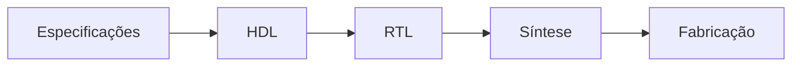

## Page 1

<!-- Imagem: Logo with red circle and green squares -->
INSTITUTO FEDERAL
DE EDUCAÇÃO, CIÊNCIA E TECNOLOGIA
Minas Gerais
Campus Bambuí

Disciplina: BiSuEEA.512 – Sistemas Embarcados
2º semestre – 2025
Notas de Aula 12

Instrutor: Williams L. Nicomedes
Laboratório de Automação e Controle – Núcleo 2 de Laboratórios, Sala 02

williams.nicomedes@ifmg.edu.br

18/11/2025

---


## Page 2

A linguagem VHDL


---


## Page 3

# Fluxo de projeto



1.  **Especificações** sobre o sistema digital a ser construído (circ. comb., seq,...). Modelo de chip FPGA e ferramenta EDA a serem empregados.

    Diferentes materiais, tensões, tempos propagação dos sinais, quantidade de blocos lógicos disponíveis, etc.

2.  **Código HDL**: Descrição do comportamento do circuito (abstração alta), sem se preocupar com o hardware.

3.  **Circuito/descrição RTL** (*register transfer level*): Circuito digital “genérico”, i.e., não leva a tecnologia em conta (ferramenta EDA). Obtido do entendimento da ferramenta em relação ao código do projetista.

---


## Page 4

# Fluxo de projeto


4. **Síntese**: A partir da descrição/circuito RTL, a ferramenta gera um arquivo *netlist* (nível de portas lógicas – *gate level* – nível baixo de abstração), levando-se em conta a tecnologia disponível em (1).

Do arquivo *netlist* sairão as informações de posicionamento e roteamento (*place and route*) que serão utilizadas para as interligações implementadas no FPGA.

*"Para implementar o circuito RTL neste chip específico eu preciso interligar..."*

5. **Fabricação**: Implementação física (ligações no chip).


---


## Page 5

# Estrutura básica dos códigos VHDL

Dividida em três unidades principais de projeto (design units):

**Bibliotecas/pacotes**, **entidade**, e **arquitetura**.

Ordem em que aparecem no código:

<!-- Imagem: A diagram showing three stacked rectangular blocks. The top block says "BIBLIOTECAS / PACOTES". The middle block says "ENTIDADE". The bottom block says "ARQUITETURA". -->


---


## Page 6

# Estrutura básica dos códigos VHDL

**Biblioteca/pacotes:** “Cabeçalho” do código. Fornecem informações sobre o que será utilizado ao longo do código, como tipos de dados, funções e componentes.

**Entidade:** Forma como o mundo enxerga o componente (ou circuito). Pinos (entradas e saídas).

**Arquitetura:** Funcionalidade do circuito, i.e., sua lógica interna. “O que acontece dentro do circuito?”

<!-- Imagem: A diagram showing a chip with "Entidade" (Entity) at the top left and "Arquitetura" (Architecture) at the bottom right, indicating the relationship between the entity and architecture. -->


---


## Page 7

# Estrutura básica dos códigos VHDL

A biblioteca ieee sempre é incluída (padronização IEEE).

Praticamente todos os módulos escritos em VHDL se iniciam como:

```vhdl
library ieee;
use ieee.std_logic_1164.all;
```

Importa a biblioteca pelo comando `library` e indica o seu uso pelo comando `use`.

1164: Padronização do IEEE (como o IEEE documenta as padronizações). Ex.: “Portaria nº...”

---


## Page 8

# Estrutura básica dos códigos VHDL

## Entradas e saídas (I/O): Tipos.

### Tipos básicos:

*   bit, std_logic, boolean, physical.

### Concatenação de elementos:

*   bit_vector(0 to 3),
*   std_logic_vector(0 to 4).

std_logic é mais geral do que bit

Inclui tipos como indeterminado, “1” forte, “1” fraco, “0” forte, “0” fraco...

<!-- Imagem: ∞ symbol -->

---


## Page 9

# Estrutura básica dos códigos VHDL

Código VHDL (em si mesmo) não gera arquivo executável.

Estamos *descrevendo um hardware* – não executando instruções.

**Obs.:** O Quartus II toma o código VHDL e produz arquivos intermediários (RTL) para programar o PLD/FPGA.

## Síntese e Fabricação/Geração (Etapas 4 e 5):

Não são obrigatórias.

*Ex.:* Código VHDL para *documentar* o funcionamento de um circuito.


---


## Page 10

Aula:
1) Produzir/testar um esquemático (circuitos combinacionais).
2) Depois, VHDL.

Objetivo: Verificar como podemos correlacionar as duas coisas (Diagramas esquemáticos e códigos).

Curso (por enquanto):
Arquivos de projeto (*Design Files*) limitados a:
*   *Block Diagram/Schematic File*
*   *VHDL File*

Arquivos de verificação (*Verification/Debugging Files*):
*   *University VWF (vector waveform)*: Formas de onda.

---


## Page 11

# Observações

## Propósito do Quartus:

Criar o circuito referente ao esquemático em uma placa CPLD/FPGA.

## Demora na simulação:

O Quartus II “entende” que vamos de fato passar o circuito para o PLD. Detalhes em nível mais baixo, sobre a configuração do PLD em questão.

Quartus II não é ferramenta SPICE.


---


## Page 12

# Observações

Qual o propósito de se escrever um código e criar um símbolo?

Construir vários blocos lógicos ("caixinhas") em VHDL, e depois montar um esquemático a partir deles..

Ex.: Podemos criar/codificar uma ME em VHDL, gerar um bloco lógico e depois usá-la em um circuito (esquemático) maior.

Dividir para conquistar. Produzir pequenos blocos para diferentes funções e depois juntar tudo (ao invés de criar tudo de uma vez).

Modelagem estrutural (Notas de Aula 10).


---


## Page 13

# Observações

Scroll (rodinha do mouse): Movimentação vertical pela tela.

Ctrl + Scroll: Aplica zoom.

Ligação – (fios):

Maneira 1: Posiciona o cursor na entrada/saída, até ele se tornar uma cruz. Arrastar até o ponto desejado.

Maneira 2: Arrastar o objeto; Encostar os pinos; Soltar o botão do mouse; Arrastar o objeto de volta à sua posição original.


---


## Page 14

# Observações

## Quartus II – Cuidados:

**Nomes dos diretórios:** Sem espaços, etc.

**Salvar projeto na pasta Desktop.**

**Nomes dos arquivos:**
‘Bloco.bdf’ e entity Bloco;

Diferentes nomes, sempre que possível.

**Compilação do esquemático:**

*Project Navigator > Arquivo esquematico > Right-click > Set as Top-Level Entity*


---


## Page 15

Códigos VHDL

Circuitos Combinacionais:

Função Booleana z = A · B + C̄.


---


## Page 16

Códigos VHDL: Tipos de arquivos no Quartus II:

*Design Files: Block Diagram/Schematic File e VHDL File;*

Verification/Debugging Files: *University Program VWF.*

<!-- Imagem: Screenshot showing three instances of the "New" dialog box from Quartus II. Each instance lists various file types under "New Quartus II Project" with sections like "Design Files", "Memory Files", "Verification/Debugging Files", and "Other Files". The "Verification/Debugging Files" section includes "In-System Sources and Probes File", "Logic Analyzer Interface File", "SignalTap II Logic Analyzer File", and "University Program VWF". The "Other Files" section includes "AHDL Include File", "Block Symbol File", "Chain Description File", "Synopsys Design Constraints File", and "Text File". Each dialog has buttons labeled "OK", "Cancel", and "Help". -->


---


## Page 17

# Função Booleana z = A · B + C

Circuito (diagrama esquemático) e bloco lógico.

<!-- Imagem: A schematic diagram showing inputs A, B, and C connected to a NOT gate (inst2), an AND gate (AND2), and an OR gate (OR2). The output of the AND gate is connected to the OR gate. The output of the OR gate is labeled D. Below this circuit, a block labeled "BlocoComb" has three inputs (in1, in2, in3) and one output (out1). The output out1 is connected to another output labeled E. -->


---


## Page 18

# Função Booleana z = A · B + C

## Bloco lógico: Código VHDL

```vhdl
library ieee;
use ieee.std_logic_1164.all;

--Lista I/O
entity BlocoComb is
    port(in1, in2, in3 : in std_logic;
        out1 : out std_logic);
end BlocoComb;

--Lógica do bloco
architecture Funcionamento of BlocoComb is
    signal x, y : std_logic;
begin
    x <= in1 AND in2;
    y <= NOT (in3);
    out1 <= x OR y;
end Funcionamento;
```

---


## Page 19

# Função Booleana z = A · B + C

## Bloco lógico: Código VHDL

entity: 3 entradas e 1 saída, do tipo std_logic;
Declaradas em port;

Um sinal (signal) é equivalente a uma fiação interna ao bloco lógico:
Sinais são declarados dentro da architecture;
signal x: Saída da porta AND;
signal y: saída da porta NOT.

Geração do bloco, inserção no esquemático e compilação:

Analyze Current File
File > Create/Update > Create Symbol Files (...)


---


## Page 20

Função Booleana z = A · B + C

Formas de onda: Especificação dos sinais de entrada:

Arquivos *University Program VWF*;

Verificação do funcionamento do circuito.

<!-- Imagem: Waveform diagram showing input signals A, B, and C with values 0 at 0 ps, rising to 1 around 100 ns, and output signals D and E with values X (unknown) at 0 ps, rising to 1 around 300 ns. -->


---


## Page 21

# Função Booleana z = A · B + C

Formas de onda: Saídas em função das entradas:

<!-- Imagem: Waveform diagram showing input signals A, B, C and output signal D/E. The x-axis ranges from 0 ps to 800.0 ns. The y-axis shows "Value at 0 ps" with labels for A, B, C, D, and E. -->

Tabela-verdade:

<table>
  <thead>
    <tr>
      <th>C</th>
      <th>B</th>
      <th>A</th>
      <th>z</th>
    </tr>
  </thead>
  <tbody>
    <tr>
      <td>0</td>
      <td>0</td>
      <td>0</td>
      <td>1</td>
    </tr>
    <tr>
      <td>0</td>
      <td>0</td>
      <td>1</td>
      <td>1</td>
    </tr>
    <tr>
      <td>0</td>
      <td>1</td>
      <td>0</td>
      <td>1</td>
    </tr>
    <tr>
      <td>0</td>
      <td>1</td>
      <td>1</td>
      <td>1</td>
    </tr>
    <tr>
      <td>1</td>
      <td>0</td>
      <td>0</td>
      <td>0</td>
    </tr>
    <tr>
      <td>1</td>
      <td>0</td>
      <td>1</td>
      <td>0</td>
    </tr>
    <tr>
      <td>1</td>
      <td>1</td>
      <td>0</td>
      <td>0</td>
    </tr>
    <tr>
      <td>1</td>
      <td>1</td>
      <td>1</td>
      <td>1</td>
    </tr>
  </tbody>
</table>

