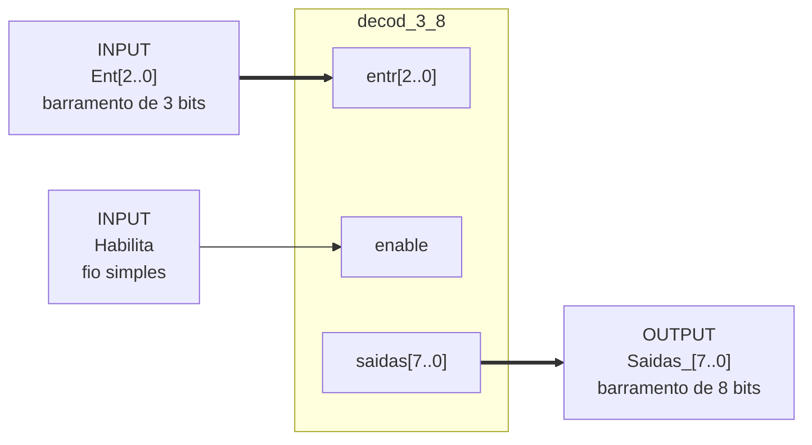

# Guia de conexão dos pinos no Quartus II

Este guia mostra como ligar o bloco `decod_3_8` a pinos de entrada e saída em um
arquivo esquemático do Quartus II. O bloco vem da Lista de Exercícios nº 5.

> [!NOTE]
> O código VHDL do `decod_3_8` não está neste repositório. A pasta `src/semana-16/`
> contém o `decod_2_4`, que é um exercício diferente. Veja `entregas/lista-05.pdf`.

## O bloco decod_3_8

<!-- TODO(img): docs/img/decod-3-8-bloco.png — captura do símbolo decod_3_8 gerado pelo Quartus II, mostrando os pinos entr[2..0], enable e saidas[7..0] -->

O bloco tem três portas:

| Porta | Direção | Tipo | Largura |
| --- | --- | --- | --- |
| `entr[2..0]` | entrada | barramento | 3 bits |
| `enable` | entrada | fio simples | 1 bit |
| `saidas[7..0]` | saída | barramento | 8 bits |

## Diagrama de conexão



## Passo 1: inserir o bloco no esquemático

1. Abra **File → New → Block Diagram/Schematic File**.
2. Dê um duplo clique na área de trabalho. A janela **Symbol** abre.
3. Navegue até **Project → decod_3_8**.
4. Clique em **OK** e posicione o bloco.

## Passo 2: adicionar os pinos de entrada

Para o barramento `entr[2..0]`:

1. Dê um duplo clique na área de trabalho.
2. Selecione **primitives → pin → input**.
3. Posicione o pino à esquerda do bloco.
4. Dê um duplo clique no pino.
5. Em **Pin name**, digite `Ent[2..0]`.
6. Ligue o pino à porta `entr[2..0]` do bloco.

Para o sinal `enable`:

1. Insira um segundo pino **input**.
2. Posicione o pino abaixo do primeiro.
3. Em **Pin name**, digite `Habilita`.
4. Ligue o pino à porta `enable` do bloco.

## Passo 3: adicionar o pino de saída

1. Dê um duplo clique na área de trabalho.
2. Selecione **primitives → pin → output**.
3. Posicione o pino à direita do bloco.
4. Dê um duplo clique no pino.
5. Em **Pin name**, digite `Saidas_[7..0]`.
6. Ligue o pino à porta `saidas[7..0]` do bloco.

## Regras de nomenclatura

> [!IMPORTANT]
> Um pino do esquemático não pode ter o mesmo nome de uma porta da entity VHDL.

| Regra | Errado | Certo |
| --- | --- | --- |
| Não repita o nome da porta da entity | `entr[2..0]` | `Ent[2..0]` |
| Não repita o nome da porta da entity | `enable` | `Habilita` |
| Use underscore para diferenciar | `saidas[7..0]` | `Saidas_[7..0]` |

O Quartus II e o VHDL escrevem a largura de um vetor de formas diferentes:

| Ferramenta | Notação |
| --- | --- |
| VHDL | `(N downto 0)` |
| Quartus II | `[N..0]` |

## Tipos de conexão

| Tipo | Largura | Aparência no Quartus II | Usado para |
| --- | --- | --- | --- |
| Fio simples | 1 bit | linha fina | `enable` e `Habilita` |
| Barramento | vários bits | linha grossa | `entr[2..0]` e `saidas[7..0]` |

## Como ligar dois pinos

1. Posicione o cursor sobre a ponta do pino. O cursor vira uma cruz.
2. Clique e arraste até a porta do bloco.
3. Solte o botão sobre a porta de destino.

Se a linha não virar um barramento, confira a largura dos dois lados. `Ent[2..0]`
e `entr[2..0]` têm de declarar a mesma largura.

## Checklist antes de compilar

- [ ] O pino `Ent[2..0]` está ligado a `entr[2..0]`
- [ ] O pino `Habilita` está ligado a `enable`
- [ ] O pino `Saidas_[7..0]` está ligado a `saidas[7..0]`
- [ ] Nenhum pino repete um nome da entity VHDL
- [ ] Os barramentos aparecem como linhas grossas
- [ ] O arquivo está salvo com a extensão `.bdf`
- [ ] O arquivo está definido como **Top-Level Entity**

## Resumo do esquemático

```text
    ┌─────────────────────────────────────────────────────────┐
    │                   Proj_Decoder_3_8.bdf                  │
    │                                                         │
    │   ┌──────────┐      ┌─────────────┐      ┌──────────┐   │
    │   │  INPUT   │      │  decod_3_8  │      │  OUTPUT  │   │
    │   │          │      │             │      │          │   │
    │   │Ent[2..0] │══════│entr[2..0]   │      │          │   │
    │   └──────────┘      │             │      │          │   │
    │                     │ saidas[7..0]│══════│Saidas_   │   │
    │   ┌──────────┐      │             │      │  [7..0]  │   │
    │   │  INPUT   │      │             │      └──────────┘   │
    │   │          │      │             │                     │
    │   │ Habilita │──────│enable       │                     │
    │   └──────────┘      │             │                     │
    │                     │    inst     │                     │
    │                     └─────────────┘                     │
    │                                                         │
    └─────────────────────────────────────────────────────────┘

    Legenda:  ══════  barramento (vários bits)
              ──────  fio simples (1 bit)
```
