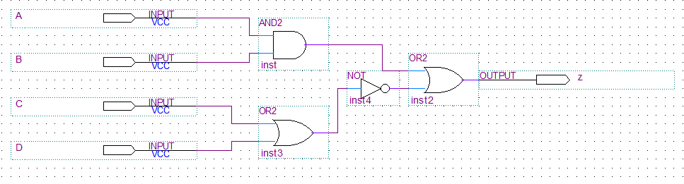
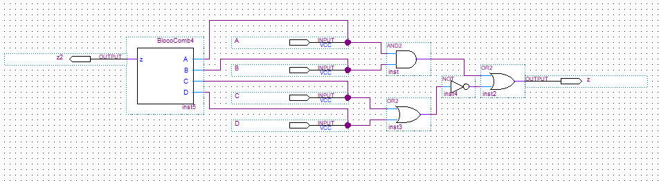
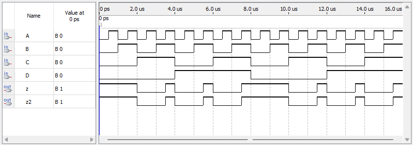
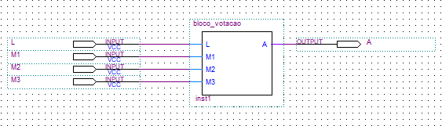
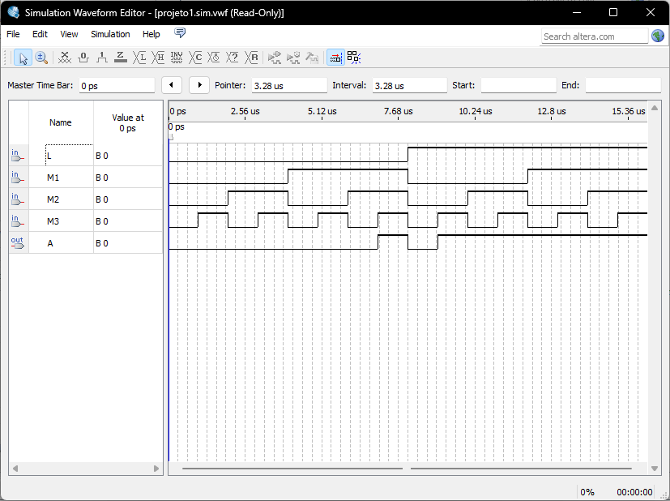
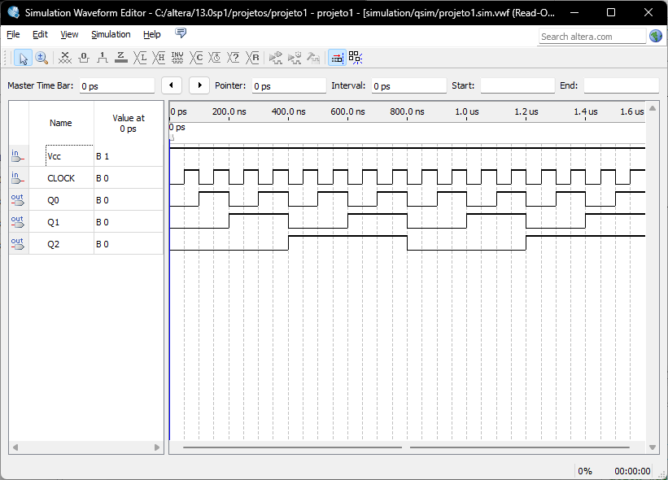
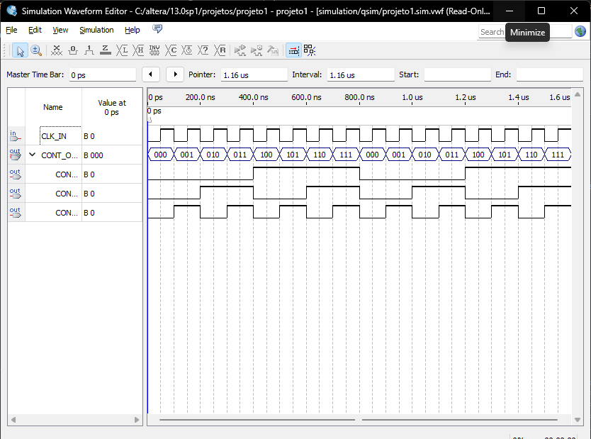

# Resultados no Quartus II

Capturas de tela retiradas das entregas corrigidas em `entregas/`. Cada seção traz o
esquemático montado no Block Editor e as formas de onda da simulação funcional.

| Entrega | Circuito | Tipo |
| --- | --- | --- |
| [Lista 3](#lista-3--função-booleana-z) | `z = A · B + (C + D)` | Combinacional |
| [Lista 4](#lista-4--circuito-de-votação) | `bloco_votacao` | Combinacional |
| [Lista 5](#lista-5--decodificador-3-para-8) | `decod_3_8` | Combinacional |
| [Trabalho 1](#trabalho-1--contador-mod-8) | Contador MOD 8 | Sequencial |
| [Trabalho 2](#trabalho-2--contador-mod-8-encapsulado) | Contador MOD 8 encapsulado | Sequencial |

## Lista 3 – Função booleana z

A lista pedia a função `z = A · B + (C + D)` de duas formas: montada com portas
lógicas no esquemático, e descrita em VHDL. As saídas das duas versões tinham de ser
comparadas.

Circuito com portas lógicas. Quatro entradas, uma porta AND2, uma OR2, uma NOT e uma
OR2 final:

As duas versões no mesmo esquemático. O bloco `BlocoComb4`, gerado a partir do VHDL,
produz `z2`. O circuito de portas produz `z`:

Na simulação, `z` e `z2` são idênticas em todos os instantes:

## Lista 4 – Circuito de votação

Quatro entradas binárias: `L` é o voto do líder, `M1`, `M2` e `M3` são os votos dos
membros. `0` rejeita e `1` aceita. A saída `A` indica a aprovação.

## Lista 5 – Decodificador 3 para 8

Decodificador com três entradas de seleção e uma entrada de habilitação, escrito com
`process` e `case` em VHDL. O guia de ligação dos pinos está em
[`listas/guia-lista-05.md`](listas/guia-lista-05.md).

![Esquemático do decod_3_8 no Quartus II. Os pinos Ent[2..0] e Habilita entram à esquerda, o barramento Saidas_[7..0] sai à direita](img/decod-3-8-esquematico.png)

A simulação separa os dois regimes. Até 16 µs, `Habilita` fica em `0` e todas as
saídas ficam em `0`. Depois de 16 µs, cada combinação de `Ent[2..0]` aciona uma única
saída:

## Trabalho 1 – Contador MOD 8

Contador de módulo 8 construído com três flip-flops JK descritos em VHDL e ligados
entre si no esquemático. Cada flip-flop é uma instância do bloco `BlocoFF_JK`, com
`J` e `K` amarrados em `Vcc`.

## Trabalho 2 – Contador MOD 8 encapsulado

O mesmo contador, agora dentro de um único bloco VHDL em vez de três blocos ligados
no esquemático. O comportamento é o mesmo, e a diferença está na organização do
código.

